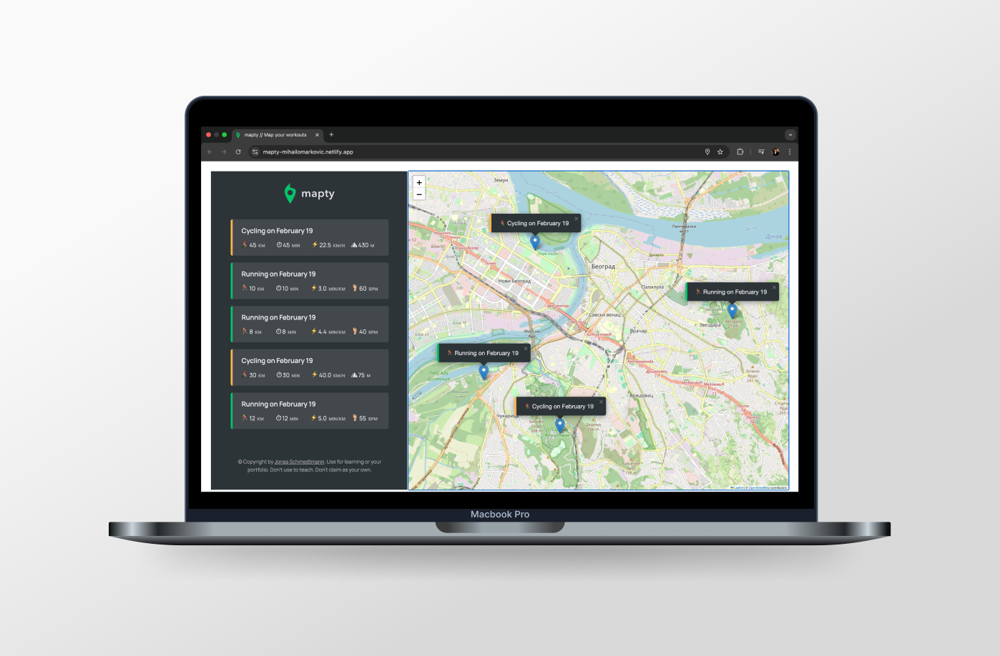

# [Mapty 🧭](https://mapty-mihailomarkovic.netlify.app/)

## Introduction

Mapty is a web application that allows users to log their outdoor activities on an interactive map. By leveraging the Geolocation API and the Leaflet library, users can pin locations where they went running or cycling and store relevant workout data. The application enhances user experience by automatically fetching live location data and persisting workout entries using local storage.

## Project Highlights

- Implemented the **Geolocation API** to capture the user’s current position dynamically.
- Integrated **Leaflet.js** for rendering and interacting with a world map.
- Enabled users to **log workouts** (cycling or running) with customizable details.
- Stored workout data using **local storage** to maintain persistence across sessions.
- Designed an intuitive **UI for managing entries**, allowing users to visualize their activities on the map.

## What I Learned

During this project, I explored several new JavaScript concepts and APIs, including:

- **Geolocation API** – Retrieving and utilizing live location data from users.
- **Leaflet Library** – Displaying interactive maps and handling coordinates effectively.
- **Local Storage** – Persisting user-generated data across sessions.
- **Object-Oriented JavaScript** – Structuring the application using classes for better maintainability.

## Project Features

- **Live location tracking** using the Geolocation API.
- **Add and manage workouts**, choosing between cycling or running.
- **Store and retrieve data** from local storage.
- **Visualize workouts** on an interactive map with markers and details.
- **Responsive and dynamic UI**, ensuring a seamless user experience.

## Technologies Used

- **JavaScript (ES6+)**
- **Geolocation API**
- **Leaflet.js**
- **Local Storage API**
- **CSS3 & HTML5**

## Closing Thoughts

Mapty was an exciting project that deepened my understanding of working with APIs, managing user interactions, and integrating third-party libraries. It provided hands-on experience with geolocation-based applications and interactive mapping, both of which are valuable skills for future projects. This project reinforced the importance of structuring code effectively and handling real-world data dynamically.
